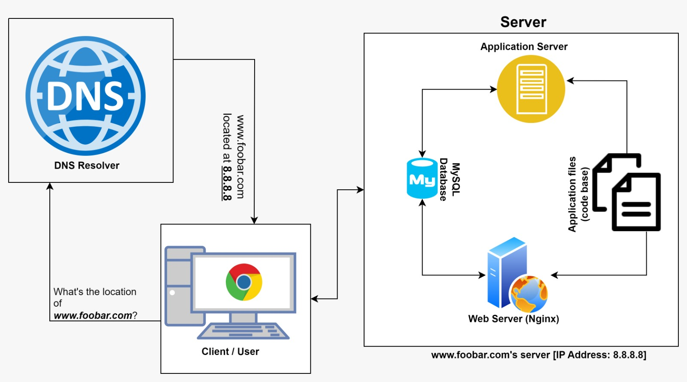

[View Board on Diagrams.net](https://drive.google.com/file/d/1xjl3rLaPSuaOhVzVbW6NcnaqZRgKat6V/view)

# **Description** 
This is a one server web infrastructure that hosts the website that is reachable via www.foobar.com. It has:
* 1 server
* 1 web server (Nginx)
* 1 application server
* 1 application files (your code base)
* 1 database (MySQL)
* 1 domain name foobar.com configured with a www record that points to your server IP 8.8.8.8

# **Specifics about this Infrastructure** 
1. **What is a server?:**
A server is a hardware or software device that accepts and responds to requests (made by clients) over a network.

2. **What is the role of the domain name?:**
A domain name enables users to easily remember the address to a certain website, rather than memorizing the actual address, which is a string of numbers.

3. **What type of DNS record www is in www.foobar.com?:**
The 'www' in 'www.foobar.com' is used to store CNAME for the host name.

4. **What is the role of the web server?:**
The web server handles HTTP requests sent using a web browser or web crawler. It provides an environment where server-side applications can process requests and send back the generated responses.

5. **What is the role of the application server?:**
The application server allows client applications, such as graphical user interface (GUIs) running on a mobile phone or personal computer, to interact with information stored in the server.

6. **What is the role of the database?:**
The database ensures for an organized and easy storage of data generated while users interact with the server. The stored data ensures application persistence beyond a single session.

7. **What is the server using to communicate with the computer of the user requesting the website?:**
The server uses the TCP/IP protocol to communicate with the user's computer over the Internet.

# **Issues with this Infrastructure**
1. __SPOF:__
This web infrastructure has an issues with SPOF (single point of failure). For instance, in case of issues with the database, the entire server becomes unusable.

2. __Downtime when maintenance needed (like deploying new code web server needs to be restarted):__
Users would not be able to interact with the server during maintenance. This because of the need to bring the server offline during maintenance activities, e.g. deploying new code to the server.

3. __Cannot scale if too much incoming traffic:__
Since there is only one application server and one web server, the infrastructure cannot handle too much incoming traffic.
