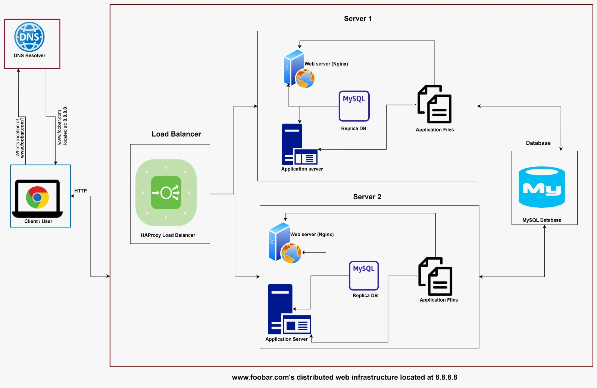

[View Board](https://drive.google.com/file/d/18DXk3AZRh2hdB6j7q-52LnxqfYc64C9G/view?usp=sharing)

# **Description** 
This is a distributed infrastructure for a three server web infrastructure that hosts the website www.foobar.com.

It has:
> * 2 servers
> * 1 web server (Nginx)
> * 1 application server
> * 1 load-balancer (HAproxy)
> * 1 set of application files (your code base)
> * 1 database (MySQL)

> # **Specifics about this infrastructure:**
> 1. **For every additional element, why you are adding it:**
>     1. This design comprises two servers, which ensures higher reliability and uptime for the application. In the event that one server fails, users can still access the web and application servers through the second server.
>
>     2. The design also incorporates the HAproxy load balancer. Upon receiving requests from users, HAproxy determines which server is available and then routes the requests to that server.
>     3. The database is hosted on its own server, and then the two servers have a connection to it. The servers create a read-only replica to ensure faster read operations. This also reduces the load on the primary database.
>
> 2. **What distribution algorithm your load balancer is configured with and how it works:**
> The load balancer is configured with 'first alive' distribution algorithm. This algorithm uses the concept of a primary server and backup servers. While the primary server is up, all requests are forwarded to this server. However, in case of outage, user requests are forwarded to backup servers.
>
> 3. **Is your load-balancer enabling an Active-Active or Active-Passive setup, explain the difference between both:**
> The load balancer is enabling 'Active-Passive' setup since the `Server 1` is the primary server, while `Server 2` is the backup server.
> In 'Active-Active' setup, the load balancer distributes requests across multiple active servers. However, in 'Active-Passive' setup, requests are distributed to the primary server, which handles the full workload, while a backup server remains on standby and only activated if the main server fails.
>
> 4. **How a database Primary-Replica (Master-Slave) cluster works:**
> A Master-Slave cluster involves maintaining a copy of data from the master (primary) database in the slave (replica) databases. While data is stored in a number of servers, it can only be updated by one server, called the "master".
>
> 5. **What is the difference between the Primary node and the Replica node in regard to the application:**
> The primary node works as the primary database while the Replica node maintains a copy of the primary database's data. The primary node is generally used for write operations, while the replica node is used for read operations.
>

> # **Issues with this Infrastructure**
> 1. **Where are SPOF?**
>       + In case the load balancer is unavailable, users would be unable to interact with the server.
>       + If the database fails, the application becomes unusable for all users.
>
> 2. **Security Issues (no firewall, no HTTPS)**:
>       + No firewall: there is no protection for preventing unauthorized access to the server.
>       + No HTTPS: communication between the servers and users' devices occurs over HTTP protocol, which is unsecured, leaving the shared data exposed to interception by third-parties.
>
> 3. **No Monitoring:**
> The infrastructure does not provide an ability to monitor the health of active server and sending alerts in case of outage.
>