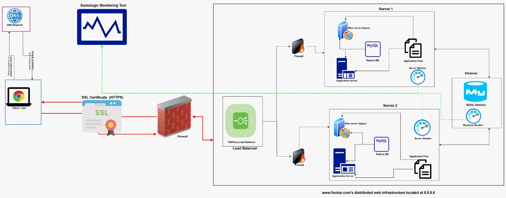

# **[View Board](https://drive.google.com/file/d/17hQCxXr3XbbiqkHgbM5xChRS5MJidUrB/view?usp=sharing)**

# **Description** 
A three server web infrastructure that hosts the website www.foobar.com, it must be secured, serve encrypted traffic, and be monitored.

It has:
> * 2 servers
> * 1 web server (Nginx)
> * 1 application server
> * 1 load-balancer (HAproxy)
> * 1 set of application files (your code base)
> * 1 database (MySQL)
> * 3 firewalls
> * 1 SSL certificate to serve www.foobar.com over HTTPS
> * 3 monitoring clients (data collector for Sumologic or other monitoring services)

> # **Specifics about this Infrastructure** 
> 1. **For every additional element, why you are adding it:**
>    + Firewalls: Added to control access to different components of the server.
>    + SSL certificate: Serves as a credential for proving ownership of a domain.
>    + Monitoring clients: used to collect data on the performance of the servers and database.
> 2. **What are firewalls for:**
> Firewalls are used to allow, limit or block network traffic based on preconfigured rules.
> 3. **Why is the traffic served over HTTPS:**
> The traffic is served over HTTPS to ensure that the communication between server and client is encrypted. This prevents third-parties from intercepting data packets exchanged between the client and server.
> 4. **What monitoring is used for:**
> Monitoring is used to collect and record data related to the performance of the server. In case of unexpected behavior during operations, an alert is sent.
> 5. **How the monitoring tool is collecting data:**
>   + The monitoring tool is collecting data by getting data on how the applications and server are working.
>
> 6. **Explain what to do if you want to monitor your web server QPS:**
> To monitor a web server's Queries-per-second (QPS) it is important to establish the baseline for important metrics, such as QPS, CPU usage, and disk space.
> Also, you should set up alerts that are sent when QPS reaches a certain threshold. This ensures quick identification and addressing of potential problems.
> It is also critical to monitor the web server's logs, which can provide valuable insights on QPS. An important use case for logs is in tracking errors, identifying slow requests, and troubleshooting performance problems.

># **Issues with this infrastructure:**
> 1. **Why terminating SSL at the load balancer level is an issue:**
>       + If load balancer is compromised, malicious actors can gain access and steal sensitive data such as credit card information and passwords.
>       + Leaves the server exposed to risk of malicious code injection.
>
> 2. **Why having only one MySQL server capable of accepting writes is an issue:**
>       + Can significantly slow down the application during periods of high traffic.
>       + If the server fails, operations that require saving data to the database also fail.
>
> 3. **Why having servers with all the same components (database, web server and application server) might be a problem:**
>       + High storage usage due to replication of the components across the servers.
>       + Security risks in the event some components in one server are compromised.
>